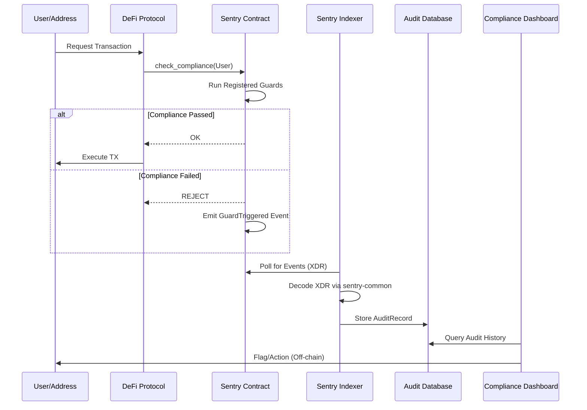

# 📐 Architecture Overview

Soroban Sentry follows a **Decoupled Infrastructure Pattern**. This ensures that the high-cost operations (indexing, auditing, reporting) happen off-chain while the critical enforcement logic stays on-chain.

## 🔄 The Sentry Loop

## 📦 Workspace Layout

### `contracts/sentry-contract` (The Gatekeeper)
- **State**: Storage of Guard configurations.
- **Events**: `GuardTriggered`, `IdentityVerified`, `AnomalyFlagged`.

### `packages/sentry-indexer` (The Observer)
- **Ingestion**: `tokio` based loop polling the `getEvents` RPC.
- **Transformation**: Maps raw XDR bytes to human-readable structs.

### `packages/sentry-common` (The Blueprint)
- **Shared Enums**: Standardizes what an "Anomaly" or "Reason" looks like across the entire stack.

### `packages/sentry-cli` (The Lens)
- **Querying**: Direct interface to the Sentry Indexer's database.

---
*Built for Scale. Built for Trust.*
